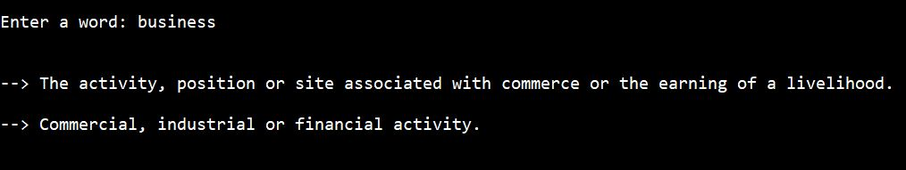
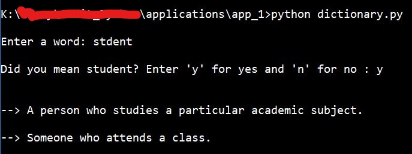
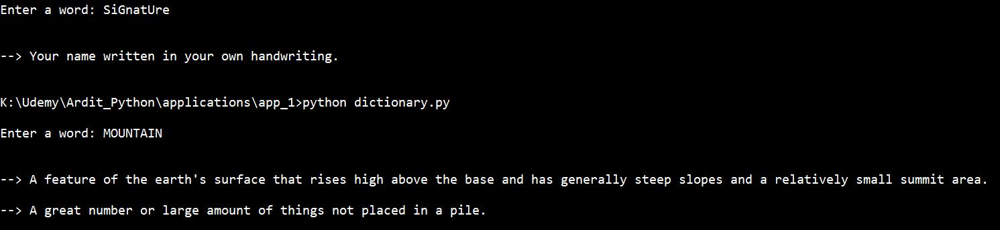

# Python-Dictionary
**Python Real World Application:** A dictionary made using Python 3.7. 
  
The code for application is in **dictionary.py** file.
  
This application reads from a json file, **data.json**, which contains data about various words and their meanings. 
  

If the user enters a wrongly spelled word, the program will suggest the word most likely matching the given input.
  
**For eg:** If the input is 'stdent', the program would ask whether the word is 'student' or not.
  

The input is **not case-sensitive**. This means that even if you write the word in small or capital letters or both, the program will interpret it as same.
  

  
Also, the user will have to interact with the program in cmd environment (Windows) as the GUI has not been made, but it will probably be done soon.
